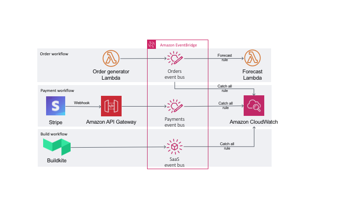

# Devax: Event Driven Architecture

These are the instructions for the demos that were part of the AWS DevAx session on event driven architecture. As part of the demo we will build a simple microservices application and use [Amazon EventBridge](https://aws.amazon.com/eventbridge/) for integration between the components. We will also look at how we can use it for integration with SaaS applications. The demo covers three EventBridge integration scenarios.

1. From your application using AWS SDK

    For this demo, we will simulate an order processing microservice communicating asynchronously with a forecasting microservice using EventBridge. We will use AWS Lambda to build both services.

2. Using webhooks and API Gateway

    For this demo, we will receive a callback from the payment processing platform, [Stripe](https://stripe.com), using webhooks. On AWS, we will use [Amazon API Gateway](https://aws.amazon.com/api-gateway/) to proxy requests directly to EventBridge.

3. Native partner integration

    We will look at an operations workflow here and show how you can receive build notifications for pipelines hosted on [Buildkite](https://buildkite.com/). We will use Buildkite's native partner integration with EventBridge.

## Architecture



## Prerequisites

1. An AWS account.
2. Python 3 and virtualenv.
3. Install Docker. Follow instructions [here](https://docs.docker.com/get-docker/).
4. Install AWS CLI. Follow instructions [here](https://docs.aws.amazon.com/cli/latest/userguide/cli-chap-install.html).
5. Install the latest version of AWS SAM CLI. Follow instructions [here](https://docs.aws.amazon.com/serverless-application-model/latest/developerguide/serverless-sam-cli-install.html).
6. Set up accounts with [Stripe](https://stripe.com) and [Buildkite](https://buildkite.com/) in order to test the payment and build workflow.
7. Install the Buildkite agent locally. Follow instructions [here](https://buildkite.com/docs/agent/v3/installation).

## Order Workflow

### 1. Create a new event bus for order details

Create an event bus for handling order details using the AWS Console. Select EventBridge from the services drop down. Expand the menu on the left and select `Event buses`. Click on `Create event bus`, specify name as `orders` and click `Create`.

### 2. Enable schema discovery

We will next enable schema discovery for the event bus. Select the event bus under `Custom event bus` section and click on `Start discovery`. You should see the `Schema discovery` column update to `Started`.

### 3. Create an IAM role for order generator Lambda function

We will now create a Lambda function to simulate order events for the event bus. Let's first create the IAM role the Lambda function will use to interact with EventBridge. In addition to EventBridge, our function also needs permission to publish to CLoudWatch.

Go to IAM on the console. Select `Roles` on the left-hand menu and then select `Create role`. Select `Lambda` on the next screen, search and select `AWSLambdaBasicExecutionRole`. You can expand this policy to check the exact permissions. This will allow access to CloudWatch logs. On the next screen, you can optionally tag the role. Name it `ordergen-function-role` and click `Create role`.

We will add EventBridge permissions as an inline policy. Select the role you just created. Click on `Add inline policy`. For service, choose EventBridge. For Actions, expand `Write` and only select `PutEvents`. On the review screen name this `eventbridge-policy` and click on `Create policy`.

### 4. Create the order generator Lambda function

We are now ready to create the Lambda function. Head over to the Lambda console and select `Create function`. Name it `oredergen-function`.  We will use the Python 3.8 runtime for this. Under `Permissions`, select `Use an existing role` and select the role you created in step 3. Select `Create function`.

Scroll down to the editor. Let's update the sample code to publish an event to the `orders` event bus. We will use the `boto3` library for this. You can refer to the `put_events` API in the Boto3 [documentation](https://boto3.amazonaws.com/v1/documentation/api/latest/reference/services/events.html#EventBridge.Client.put_events). Once updated, our code should look something like this.

```python
import boto3
import datetime
import json

events = boto3.client('events')

def lambda_handler(event, context):
    order_details = {
        "order_id": 12345,
        "order_date": str(datetime.datetime.now()),
        "items": [
            {
                "product_id": "shoe_07",
                "qty": 1,
                "price": 40.0
            }
        ],
        "customer": {
            "id": 9876543210,
            "name": "Jane Doe",
            "address": "Some address"
        }
    }

    response = events.put_events(
        Entries=[
            {
                'Source': 'Order Service',
                'DetailType': 'New Order',
                'Detail': json.dumps(order_details),
                'EventBusName': 'orders'
            },
        ]
    )

    return response
```

We can now test this function from the console. Create a test event. Select `Test`. In the `Configure test event` page, specify event name as `test`. The actual content of the event does not matter in our case. Click `Create`. Back on the Lambda page, select `Test` again. This should execute successfully.

### 5. Create an EventBridge rule to send order events to CloudWatch

Although our event has been published, we can't do anything with it because we have not yet set up a target. Go back to the EventBridge console and select `Rules`. Select `orders` from the `Event bus` dropdown. You should see a rule here that was automatically created when we enabled schema discovery. We will now set up a rule to direct all events published to this bus to CloudWatch logs.

Select `Create rule`. Name this rule `orders-catchall`. Optionally specify a description. Under `Define pattern`, select `Event pattern` followed by `Pre-defined pattern by service`. Under `Service provider`, select `All Events`. Scroll down and make sure you have selected the `orders` event bus. For `Target`, specify `CloudWatch log group`. Specify `orders-catchall` as log group name. Optionally tag the rule and hit create.

Head over to the CloudWatch console and select `Log groups`. In the filter, type in `/aws/events`. You should see `aws/events/orders-catchall` log group. Select the log group. There will be no logs here right now.

Head back to the Lambda console and test the ordergen-function again. Now, refresh the log group on the CloudWatch console and you should see a new log stream with the return data of the Lambda function.

### 6. Verify order schema in the EventBridge schema registry

In the EventBridge console, select `Schemas`. You should see a new schema named `Order-Service@NewOrder`. Select this schema and view the details that was auto-discovered. In the future, if the format of this event changes, EventBridge will automatically create a new revision.

### 7. Create the Forecast function to process order events using SAM CLI

We will now create the forecast Lambda function that will consume order events to make inventory forecasts. We will use AWS SAM CLI to do this. Open your terminal. Create a new working folder, say `devax-eventbridge`. You can run `sam --version` to confirm SAM CLI is installed. You can also try `sam --help` to see the different commands available.

We will use `sam init` to set up our project. This will prompt us for different options. If you are familiar with the options, you can directly pass them to the command and suppress the prompts. In our case, we will use a pre-built AWS QuickStart template to accelerate development. Below are the options I chose.

```bash
Which template source would you like to use?
	1 - AWS Quick Start Templates
	2 - Custom Template Location
Choice: 1

Which runtime would you like to use?
	1 - nodejs12.x
	2 - python3.8
	3 - ruby2.7
	4 - go1.x
	5 - java11
	6 - dotnetcore3.1
	7 - nodejs10.x
	8 - python3.7
	9 - python3.6
	10 - python2.7
	11 - ruby2.5
	12 - java8
	13 - dotnetcore2.1
Runtime: 2

Project name [sam-app]: forecast-app

Cloning app templates from https://github.com/awslabs/aws-sam-cli-app-templates.git

AWS quick start application templates:
	1 - Hello World Example
	2 - EventBridge Hello World
	3 - EventBridge App from scratch (100+ Event Schemas)
Template selection: 3

Do you want to use the default AWS profile [devax] and region [us-west-2]? [Y/n]: Y
Which Schema Registry would you like to use?
	1 - aws.events
	2 - discovered-schemas
Schema Registry: 2

-----------------------
Generating application:
-----------------------
Name: forecast-app
Runtime: python3.8
Dependency Manager: pip
Application Template: eventBridge-schema-app
Output Directory: .

Next steps can be found in the README file at ./forecast-app/README.md
    
Trying to get package schema code
Event code binding Registry: discovered-schemas and Schema: Order-Service@NewOrder
Generating code bindings...
Merging code bindings...
```

Open the IDE of your choice and navigate to the folder you created for this. Spend some time reviewing the code that was generated.

### 8. Update and test the Forecast function locally

We will execute all the SAM cli commands from the `forecast-app` folder. At the root of this folder, you will find a `template.yaml`. This is the SAM template that will be used to create the resources on AWS. This template defines a Lambda function that will be triggered by EventBridge event. The pattern specifies what events will trigger this function. This was automatically created based on `Order-Service@NewOrder` schema in the schema registry. We just need to uncomment the event bus name and set this to `orders`. I have also updated the resource names. This is what my Resources and Outputs sections look like.

```yaml
Resources:
  ForecastFunction:
    Type: AWS::Serverless::Function
    Properties:
      CodeUri: hello_world_function
      Handler: hello_world/app.lambda_handler
      Runtime: python3.8
      Events:
        NewOrder:
          Type: CloudWatchEvent
          Properties:
            EventBusName: orders
            Pattern:
              source:
                - Order Service
              detail-type:
                - New Order

Outputs:
  ForecastFunction:
    Description: "Forecast Lambda Function ARN"
    Value: !GetAtt ForecastFunction.Arn
  ForecastFunctionIamRole:
    Description: "Implicit IAM Role created for Forecast function"
    Value: !GetAtt ForecastFunctionRole.Arn
```

Next, open `hello_world_function/app.py`. Notice the static typing for variables based on the order event schema. Comment the update to detail_type and instead print both the incoming event and detail as shown below.

```python
    #Make updates to event payload, if desired
    #awsEvent.detail_type = "HelloWorldFunction updated event of " + awsEvent.detail_type;
    print(f"Raw Event: {event}")
    print(f"New Order: {detail}")
```

Let us test the function locally first. The events folder has a test event called `event.json`. Open this file and optionally update the detail field to match what we used for the order generator Lambda function. Next use the `sam local invoke` command as shown below. Make sure you have docker running for this.

```shell
sam local invoke ForecastFunction --event events/event.json
```

The function name must match what you have specified in the resources section of teplate.yaml. SAM will fetch the lambci/lambda:python3.8 Docker container image from DockerHub if it does not exist locally and use this to simulate the Lambda run time.

We will next run unit tests. This has also been automatically generated for you in the tests folder. Take a look at `tests/unit/test_handler.py`. It uses the pytest library. Scroll down to the bottom and change the assert statement to below.

```shell
assert awsEventRet.detail_type == "New Order"
```

Since the test has a dependency on pytest, we will first install the pytest and pytest-mock packages using virtualenv. Run the commands below.

```shell
virtualenv forecast-venv
source ./forecast-venv/bin/activate
pip install pytest pytest-mock
python -m pytest tests/ -v
```

If all went well, you should see the test pass.

### 9. Deploy Forecast function and verify

Now that local tests have passed, we are ready to deploy our code. We will make use of the `sam deploy --guided --tags 'project=devax'` command. Specifying tags is optional. Here are the options I chose. Make sure you choose the same AWS region you have been using so far.

```shell
Configuring SAM deploy
======================

	Looking for samconfig.toml :  Not found

	Setting default arguments for 'sam deploy'
	=========================================
	Stack Name [sam-app]: forecast-app
	AWS Region [us-east-1]: us-west-2
	#Shows you resources changes to be deployed and require a 'Y' to initiate deploy
	Confirm changes before deploy [y/N]: y
	#SAM needs permission to be able to create roles to connect to the resources in your template
	Allow SAM CLI IAM role creation [Y/n]: Y
	Save arguments to samconfig.toml [Y/n]: Y

	Looking for resources needed for deployment: Found!

		Managed S3 bucket: aws-sam-cli-managed-default-samclisourcebucket-<xxxx>
		A different default S3 bucket can be set in samconfig.toml
```

If this is the first time you are using SAM CLI, a new S3 bucket will be created for you. You will also see a changeset showing all the resources that will be created. Confirm deploying the changeset. This will create a CloudFormation stack to deploy the resources. You can view the progress on the terminal. If you head to the CloudFormation console, you should see a new stack created.

We are now ready to test the integration. Head over to the Lambda console and select your Forecast function. It should have a name similar to `forecast-app-ForecastFunction-xxxxxx`. Go to the monitoring tab and select `View logs in CloudWatch`. There should be no log streams. Now open the orgergen-function from the console and test it. Go back and refresh the forecast function logs. You should now see a log stream. Select it and you should see both the raw event Lambda received and the new order.

### 10. Transform event sent to Forecast function

The Forecast function right now receives all of the event including customer details which is not really needed. We will transform our event before triggering the function to remove this. We will do this using the AWS CLI.

> At the time of writing this, there is a [bug](https://github.com/aws/aws-cli/issues/4841) preventing this from being added using the console.

First, list all targets for the Forecast function, using the command below. Substitute your rule name.

```shell
aws events list-targets-by-rule --rule forecast-app-ForecastFunctionNewOrder-xxxxx --event-bus-name orders
```

Note down the Id and the Arn. Then create a `target.json` file with contents below. Update the Id and Arn to values you got from command above.

```json
[
  {
    "Id": "ForecastFunctionNewOrderLambdaTarget",
    "Arn": "<Arn from list-targets-by-rule command>",
    "InputTransformer": { 
      "InputPathsMap": { 
        "order_id" : "$.detail.order_id",
        "order_date" : "$.detail.order_date",
        "items" : "$.detail.items"
      },
      "InputTemplate": "{\"order_id\": <order_id>,\"order_date\": <order_date>,\"items\": <items>}"
   }
  }
]
```

Then apply the changes using the command below.

```shell
aws events put-targets --rule forecast-app-ForecastFunctionNewOrder-xxxxxx --targets file://target.json --event-bus-name orders
```

You can verify changes have been applied by heading over to the EventBridge console. Select `Rules`. Select the orders bus and you will see a rule for the forecast function. Scroll down to `Targets` and you should see the updated transform.

Now test the ordergen-function from the Lambda console again. Refresh the Forecast function CloudWatch logs and observe the results. You will now see the raw event only has order details. Something like this.

```json
{
    "order_id": "12345",
    "order_date": "2020-05-24 07:38:01.979602",
    "items": [{"product_id": "shoe_07", "qty": 1, "price": 40.0}]
}
```

New order field is null because of the static typing. As event no longer confirms to the schema, the marshaller was unable to deserialize the event.

## Payment Workflow

### 1. Create a new event bus for Stripe payments

From the EventBridge console, create a new event bus and name is `payments`. Create a catch all rule to send all events to CloudWatch logs. Refer to step 5 of the order workflow above.

### 2. Create IAM role for API Gateway to access EventBridge

We will follow instructions similar to step 3 for the order workflow, only here we are creating the role for API Gateway. When you create a role, select API Gateway for service. This should show the use case "Allows API Gateway to push logs to CloudWatch Logs". Leave the policy selected. Optionally tag the role and name it `stripe-api-role`.

Add an inline policy for EventBridge access. The steps here are identical to what you did for the ordergen-lambda function.

### 3. Set up API Gateway for Stripe callback

Head over to the API Gateway console and select "REST API". Click on `Build`. Set the API name to `stripe-api`. Leave all other options unchanged. Create a resource named payments and enable CORS. Define a POST method for this. Specify options as shown below.

```shell
Integration type: AWS Service
AWS Region: <your region where event bus is>
AWS Service: CloudWatch Events
HTTP method: ANY
Action: PutEvents
Execution role: <arn of role you created in step 2 above>
```

Click `Save`. There are a couple of other things we need before we can get this to work. Go to `Integration Request` for this POST method and expand the `HTTP Headers` section. We need to add the two headers shown below.

```shell
X-Amz-Target: 'AWSEvents.PutEvents'
Content-Type: 'application/x-amz-json-1.1'
```

> You can find the PutEvents API documentation [here](https://docs.aws.amazon.com/eventbridge/latest/APIReference/API_PutEvents.html).

Next, we will define a mapping template to map the event from Stripe to confirm to the envelope that EventBridge expects. Refer to the Stripe API documentation [here](https://stripe.com/docs/api/events/object). Expand `Mapping Templates` and select `Add mapping template`. Set Content-Type to application/json. Select Yes in the pop up. Copy-paste the VTL template below.

```json
{
    "Entries": [
        {
            "DetailType": $input.json('$.type'),
            "Source": "stripe",
            "EventBusName": "payments",
            "Detail": "$util.escapeJavaScript($input.json('$'))"
        }
    ]
}
```

Save this and deploy the API to a new stage named production. Note down the Invoke URL.

### 4. Set up as webhook from Stripe

Login to your Stripe account and head to the `Developers` menu on the left. Select `Webhooks` and then `Add Endpoint`. Specify `<API Gateway invoke url>/payments` as the `Endpoint URL`. Optionally specify a description and for `Events to send`, select `Payment Intent`. Click on `Add Endpoint`.

Before you test, head over to the `/aws/events/payments-catchall` log group on CloudWatch console and make sure there are no logs. Head over to Payments in Stripe and click `New`. Enter currency and amount of your choice. For card details, you can use the number specified in their [testing docs](https://stripe.com/docs/testing). Enter statement description as `Test EventBridge` and click `Create payment`. You can also test directly from the webhooks page.

Now, refresh your CloudWatch logs group and you should see new log streams. You should see one event for `payment_intent.created` and another for `payment_intent.succeeded`.

## Build Workflow

### 1. Setup Buildkite partner integration

From the EventBridge console, select `Partner event sources`. Search for Buildkite and select `Setup`. Follow instructions here to set up Buildkite integration.

### 2. Set up event bus for Buildkite

Once you complete step 1, you should see Buildkite integration show up under `Partner event sources` in `Pending` status. Select it and click `Associate with event bus`. The status will change to `Active`.

Create a catchall rule for this event bus to send all event to a CloudWatch logs group `/aws/events/buildkite-catchall`. This is similar to what we did for the orders workflow in step 5. Verify there are no streams in the log group.

Set up a pipeline on Buildkite. You can use one of their sample pipelines [here](https://github.com/buildkite/example-pipelines). Start the Buildkite agent locally using the command below. Then trigger a build from the Buildkite console.

```shell
buildkite-agent start
```

Once the build completes, refresh the CloudWatch log group and you should see new streams. It will be easier to view all the events using CloudWatch logs insights.

## Cleanup

1. Delete the resources created by the SAM template using the command below.

    ```shell
    aws cloudformation delete-stack --stack-name forecast-app
    ```

    Delete the forecast Lambda function logs.

    ```shell
    for log_group in $(aws logs describe-log-groups --log-group-name-prefix '/aws/lambda/forecast-app-ForecastFunction-' --query "logGroups[*].logGroupName" --output text); do
      echo "Removing log group ${log_group}..."
      aws logs delete-log-group --log-group-name ${log_group}
      echo
    done
    ```

2. Delete ordergen-function from Lambda console and its CloudWatch logs from the CloudWatch console.

    ```shell
    aws lambda delete-function --function-name ordergen-function
    aws logs delete-log-group --log-group-name /aws/lambda/ordergen-function
    ```

3. Delete the IAM roles for ordergen-function and Stripe API Gateway.

    ```shell
    aws iam list-attached-role-policies --role-name stripe-api-role # get the managed policy attached
    aws iam detach-role-policy --role-name stripe-api-role --policy-arn <arn from command above> # detach managed policy
    aws iam list-role-policies --role-name stripe-api-role # get the inline policy
    aws iam delete-role-policy --role-name stripe-api-role --policy-name <policy name from command above> # delete inline policy
    aws iam delete-role --role-name stripe-api-role # delete role

    aws iam list-attached-role-policies --role-name ordergen-function-role # get the managed policy attached
    aws iam detach-role-policy --role-name ordergen-function-role --policy-arn <arn from command above> # detach managed policy
    aws iam list-role-policies --role-name ordergen-function-role # get the inline policy
    aws iam delete-role-policy --role-name ordergen-function-role --policy-name <policy name from command above> # delete inline policy
    aws iam delete-role --role-name ordergen-function-role # delete role
    ```

4. Delete API Gateway.

    ```shell
    aws apigateway get-rest-apis --query 'items[?name == `stripe-api`].id'
    aws apigateway delete-rest-api --rest-api-id <id from command above>
    ```

5. Delete the custom event buses - orders and payments. Targets have to be deleted first, followed by rules and finally the event bus. Let us look at payments first.

    ```shell
    aws events list-rules --event-bus-name payments
    aws events list-targets-by-rule --rule <name from command above> --event-bus-name payments
    aws events remove-targets --rule <name from first command> --event-bus-name payments --ids <id from command above>
    aws events delete-rule --name <name from first command> --event-bus-name payments
    aws events delete-event-bus --name payments
    aws logs delete-log-group --log-group-name /aws/events/payments-catchall
    ```

    Orders will have 2 rules as it has schema discovery enabled. The commands to delete catch all rule will be identical to payments event bus.

    ```shell
    aws events list-rules --event-bus-name orders
    aws events list-targets-by-rule --rule <name from command above for catch all rule> --event-bus-name orders
    aws events remove-targets --rule <name from first command for catch all rule> --event-bus-name orders --ids <id from command above>
    aws events delete-rule --name <name from first command for catch all rule> --event-bus-name orders
    aws logs delete-log-group --log-group-name /aws/events/orders-catchall
    ```

    At the time of writing this, it is not possible to list targets for the schema discovery rule from CLI. Head over to the EventBridge console, select the `orders` event bus. Stop schema discovery and delete the discoverer. This will automatically delete the rule. Now you can delete the event bus.

    ```shell
    aws events delete-event-bus --name orders
    ```

    Delete the auto-discovered schema from the schema registry using the console.

6. Delete the webhook configuration from Stripe.

7. Delete EventBridge notification from Buildkite. If you go to `Partner event sources` on the EventBridge console, the status will be set to `Deleted`. You can now follow the same steps you did for the other event buses to delete it.

    ```shell
    aws events list-rules --event-bus-name <buildkite event bus>
    aws events list-targets-by-rule --rule <name from command above> --event-bus-name <buildkite event bus>
    aws events remove-targets --rule <name from first command> --event-bus-name <buildkite event bus> --ids <id from command above>
    aws events delete-rule --name <name from first command> --event-bus-name <buildkite event bus>
    aws events delete-event-bus --name <buildkite event bus>
    aws logs delete-log-group --log-group-name /aws/events/buildkite-catchall
    ```
